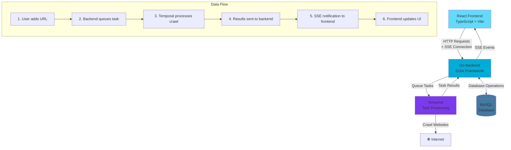

# Sykell - Web Crawler Application

A full-stack web application that crawls websites and extracts key information about web pages. Built with Go backend, React frontend, and Temporal for reliable task processing.

## What it does

This application allows users to:

- **Add URLs** for analysis and crawling
- **Start/stop processing** on selected URLs with real-time control
- **View detailed results** including HTML version, page title, heading counts (H1, H2, etc.), internal vs external links, inaccessible links, and login form detection
- **Monitor crawl progress** in real-time with live status updates
- **Browse results** through a paginated, sortable dashboard

## Architecture

The application follows a microservices architecture with asynchronous task processing:



### Key Features

- **Asynchronous Processing**: URLs are queued to Temporal for reliable background processing
- **Real-time Updates**: Server-Sent Events (SSE) provide live status updates to the frontend
- **Scalable Architecture**: Temporal handles task distribution and fault tolerance
- **Cache Invalidation**: Frontend automatically refetches data when updates are received
- **Authentication**: JWT-based API authorization for secure access

## Technology Stack

### Backend
- **Go** with Echo framework
- **MySQL** database with SQLC for type-safe queries
- **Temporal** for reliable task processing
- **JWT** authentication
- **Server-Sent Events** for real-time updates

### Frontend
- **React** with TypeScript
- **Vite** for fast development and building
- **Tailwind CSS** for styling
- **React Query** for data fetching and caching

### Infrastructure
- **Docker Compose** for local development
- **Database migrations** for schema management
- **Environment-based configuration**

## Quick Start

### Prerequisites

- Docker and Docker Compose
- Go 1.21+ (for backend development)
- Node.js 18+ (for frontend development)

### Running the Application

1. **Clone the repository**
   ```bash
   git clone <repository-url>
   cd sykell
   ```

2. **Start the backend services**
   ```bash
   cd backend
   make dev-setup
   make run
   ```

3. **Start the frontend** (in a new terminal)
   ```bash
   cd frontend
   npm install
   npm run dev
   ```

4. **Access the application**
   - Frontend: http://localhost:5173
   - Backend API: http://localhost:8080
   - Database Admin: http://localhost:8081

## Detailed Setup Instructions

For detailed setup and development instructions, see:

- **Backend Setup**: [backend/README.md](./backend/README.md)
- **Frontend Setup**: [frontend/README.md](./frontend/README.md)

## Project Structure

```
sykell/
├── backend/              # Go backend application
│   ├── cmd/             # Application entrypoints
│   ├── internal/        # Business logic and handlers
│   ├── migrations/      # Database migrations
│   └── sql/            # SQL queries and schema
├── frontend/            # React frontend application
│   ├── src/            # Source code
│   ├── public/         # Static assets
│   └── dist/           # Built application
└── README.md           # This file
```

## Contributing

1. Fork the repository
2. Create a feature branch
3. Make your changes
4. Add tests for new functionality
5. Submit a pull request

## License

This project is for evaluation purposes as part of the Sykell backend developer assessment.