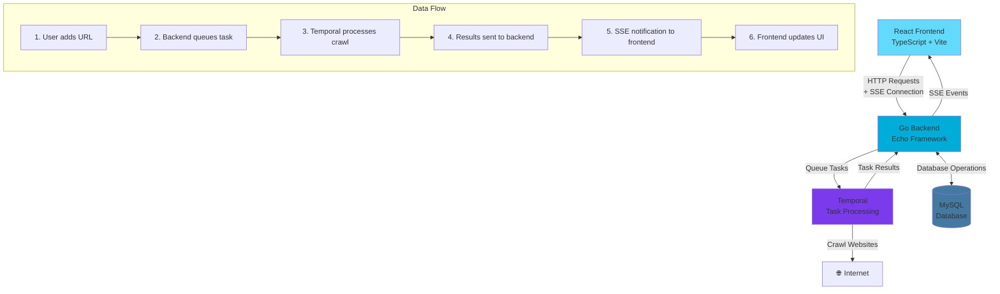

# Sykell - Web Crawler Application

A full-stack web application that crawls websites and extracts key information about web pages. Built with Go backend, React frontend, and Temporal for reliable task processing.

## What it does

This application allows users to:

- **Add URLs** for analysis and crawling
- **Start/stop processing** on selected URLs with real-time control
- **View detailed results** including HTML version, page title, heading counts (H1, H2, etc.), internal vs external links, inaccessible links, and login form detection
- **Monitor crawl progress** in real-time with live status updates
- **Browse results** through a paginated, sortable dashboard

## Architecture

The application follows a microservices architecture with asynchronous task processing:



### Key Features

- **Asynchronous Processing**: URLs are queued to Temporal for reliable background processing
- **Real-time Updates**: Server-Sent Events (SSE) provide live status updates to the frontend
- **Scalable Architecture**: Temporal handles task distribution and fault tolerance
- **Cache Invalidation**: Frontend automatically refetches data when updates are received
- **Authentication**: JWT-based API authorization for secure access

## Technology Stack

### Backend
- **Go** with Echo framework
- **MySQL** database with SQLC for type-safe queries
- **Temporal** for reliable task processing
- **JWT** authentication
- **Server-Sent Events** for real-time updates

### Frontend
- **React** with TypeScript
- **Vite** for fast development and building
- **Tailwind CSS** for styling
- **React Query** for data fetching and caching

### Infrastructure
- **Docker Compose** for local development
- **Database migrations** for schema management
- **Environment-based configuration**

## Quick Start

### Prerequisites

- Docker and Docker Compose
- Go 1.21+ (for backend development)
- Node.js 18+ (for frontend development)

### Running the Application

1. **Clone the repository**
   ```bash
   git clone <repository-url>
   cd sykell
   ```

2. **Start everything all in one**
   ```bash
   # for the first time to run the migrations and setup the db
   docker compose --profile migration up migrate

   docker compose up
   ```

3. **Access the application**
   - http://localhost   
   

## Detailed Setup Instructions

For detailed setup and development instructions, see:

- **Backend Setup**: [backend/README.md](./backend/README.md)
- **Frontend Setup**: [frontend/README.md](./frontend/README.md)
- **E2E Tests**: [e2e/README.md](./e2e/README.md)

## Project Structure & Architecture

### Overview

The project follows a **feature-first architecture** with clear separation of concerns:

```
sykell/
├── e2e/                  # End-to-end tests using Playwright
│   ├── tests/           # Test specifications
│   └── .gitignore       # Test artifacts exclusion
├── backend/              # Go backend application (feature-first)
│   ├── cmd/             # Application entrypoints
│   │   ├── main.go      # Main server
│   │   └── worker/      # Temporal worker
│   ├── internal/        # Business logic (feature-based)
│   │   ├── config/      # Configuration management
│   │   ├── crawl/       # Crawling feature
│   │   ├── url/         # URL management feature
│   │   ├── user/        # User management feature
│   │   ├── middleware/  # HTTP middleware (JWT, Zap)
│   │   ├── temporal/    # Temporal service integration
│   │   ├── db/          # Database layer (SQLC generated)
│   │   └── utils/       # Shared utilities
│   ├── migrations/      # Database migrations
│   ├── sql/queries/     # SQL queries for SQLC
│   └── tests/
│       └── integration/ # Integration tests (separate from unit tests)
├── frontend/            # React frontend (component-based)
│   └── src/
│       ├── components/  # Reusable UI components
│       ├── pages/       # Page components
│       ├── services/    # API communication layer
│       ├── hooks/       # Custom React hooks
│       ├── context/     # React context providers
│       └── types/       # TypeScript type definitions
└── README.md
```

### Backend Architecture

#### Feature-First Design
Each feature follows the **SOLID principles** and contains:

- **`handler.go`** - HTTP request handling and validation
- **`service.go`** - Business logic implementation  
- **`repo.go`** - Data access layer (interface-based)
- **`dto.go`** - Data Transfer Objects for API contracts

Additional files can be created to prevent bloat:
- **`start.go`**, **`stop.go`** - Extended service methods
- **`notifications.go`**, **`sse.go`** - Extended handler methods

#### Layer Responsibilities

1. **Handler Layer** (`*_handler.go`)
   - Network communication only
   - Request validation and parsing
   - Response formatting
   - Authentication via Bearer token (except SSE)

2. **Service Layer** (`*_service.go`) 
   - Pure business logic
   - Feature orchestration
   - Data transformation
   - Business rule enforcement

3. **Repository Layer** (`*_repo.go`)
   - Data access abstraction
   - **Always interfaces** to decouple from SQLC
   - Database operations
   - Query composition

#### Key Design Decisions

- **Repository Interfaces**: Prevents tight coupling to SQLC-generated code
- **Unit Tests**: Co-located with source code in same package
- **Integration Tests**: Separate `tests/integration/` folder
- **Logging**: Zap logger throughout the application
- **Authentication**: 
  - Bearer token auth for API endpoints
  - Cookie-based auth for SSE (header limitations)

#### Temporal Integration

- **Scalable Workers**: Multiple worker instances can process tasks
- **Durability**: Tasks survive system restarts
- **Fault Tolerance**: Automatic retries and error handling
- **Task Queue**: Decouples web requests from long-running crawl operations

### Frontend Architecture

#### Component-Based Design

The React frontend follows a **component-based architecture**:

1. **Components** (`src/components/`)
   - Reusable UI building blocks
   - `AddUrlModal.tsx`, `UrlTable.tsx`, `Pagination.tsx`
   - Pure presentation logic

2. **Pages** (`src/pages/`)
   - Route-level components
   - `Dashboard.tsx`, `LoginPage.tsx`
   - Page-specific business logic

3. **Services** (`src/services/`)
   - API communication layer
   - `api.ts`, `auth.ts`, `dashboardApi.ts`
   - HTTP client abstractions

4. **Hooks** (`src/hooks/`)
   - Custom React hooks for data fetching
   - `useCrawlUpdates.ts`, `useDashboard.ts`
   - Reusable stateful logic

5. **Context** (`src/context/`)
   - Global state management
   - `AuthContext.tsx` for authentication state
   - Cross-component data sharing

6. **Types** (`src/types/`)
   - TypeScript definitions
   - API contracts and validation schemas
   - Type safety across the application

### Testing Strategy

#### E2E Tests (`e2e/`)
- **Playwright-based** end-to-end testing
- Complete user workflows: signup → login → add URL → crawl → verify
- Real browser automation and validation

#### Backend Testing
- **Unit Tests**: Co-located with source files (`*_test.go`)
- **Integration Tests**: Separate folder (`tests/integration/`)
- Table-driven test patterns
- Mock interfaces for external dependencies

#### Example Feature Structure
```
internal/crawl/
├── handler.go          # HTTP endpoints
├── service.go          # Crawl orchestration  
├── repo.go            # Data persistence interface
├── dto.go             # API request/response models
├── worker.go          # Temporal worker implementation
├── start.go           # Service extension: start crawl
├── stop.go            # Service extension: stop crawl
├── notifications.go   # Handler extension: SSE
└── sse.go            # Handler extension: real-time updates
```

This architecture ensures:
- **Maintainability**: Clear separation of concerns
- **Testability**: Each layer can be tested independently  
- **Scalability**: Features can be developed in parallel
- **Reliability**: Fault-tolerant task processing with Temporal


## License

This project is for evaluation purposes as part of the Sykell backend developer assessment.